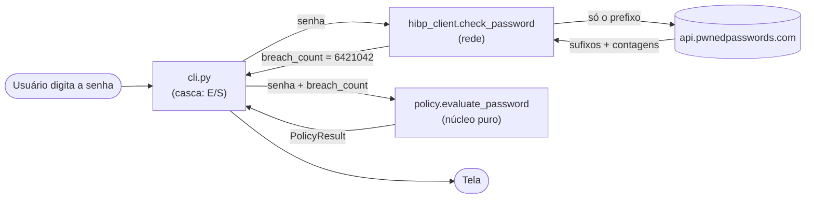
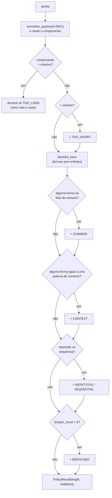

# PwnCheck — Fase 2: política de força de senha

> **Objetivo:** decidir se uma senha é boa o bastante — não com as regras de "uma maiúscula,
> um número e um símbolo", mas com o que a pesquisa e o NIST recomendam hoje: comprimento,
> lista de bloqueio e vazamentos. Tudo em **funções puras**, com testes.
>
> **Pré-requisito:** [Fase 1 — cliente k-anonymity](fase-1-k-anonymity.md).

**O que você vai aprender:** NIST SP 800-63B-4 · Unicode de verdade (code points, NFC,
`casefold`) · `enum` e `StrEnum` · `@dataclass` com `frozen` e `slots` · `@property` ·
expressões regulares (`re`, `fullmatch`, retrorreferência) · ReDoS · `str.maketrans` ·
operações de conjunto · parâmetros só-nomeados (`*`) · `functools.cache` ·
`importlib.resources`.

> **Sobre os diagramas:** os blocos marcados como `mermaid` viram desenhos quando a lição é
> aberta no GitHub (ou no VS Code com a extensão *Markdown Preview Mermaid Support*). Os
> desenhos em texto puro funcionam em qualquer lugar. No fim há um **glossário** com todos os
> termos técnicos.

**Sumário**
1. [O problema: as regras que todo mundo odeia](#1-o-problema-as-regras-que-todo-mundo-odeia)
2. [O que o NIST pede hoje](#2-o-que-o-nist-pede-hoje)
3. [A estrutura e o caminho de uma senha](#3-a-estrutura-e-o-caminho-de-uma-senha)
4. [`Rule`: enum que também é texto](#4-rule-enum-que-também-é-texto)
5. [`@dataclass`: structs com superpoderes](#5-dataclass-structs-com-superpoderes)
6. [Unicode: o que é "um caractere"?](#6-unicode-o-que-é-um-caractere)
7. [Lista de bloqueio: a senha inteira, sem enfeites](#7-lista-de-bloqueio-a-senha-inteira-sem-enfeites)
8. [Expressões regulares](#8-expressões-regulares)
9. [ReDoS: quando a regex vira ataque](#9-redos-quando-a-regex-vira-ataque)
10. [`evaluate_password`: juntando tudo](#10-evaluate_password-juntando-tudo)
11. [A lista de senhas comuns](#11-a-lista-de-senhas-comuns)
12. [Testes](#12-testes)
13. [A CLI ganhou a política](#13-a-cli-ganhou-a-política)
14. [Mão na massa](#14-mão-na-massa)
15. [Decisões de design (bom assunto para entrevista)](#15-decisões-de-design-bom-assunto-para-entrevista)
16. [Glossário](#16-glossário)
17. [Exercícios](#17-exercícios)
18. [Próxima fase](#18-próxima-fase)

---

## 1. O problema: as regras que todo mundo odeia

Você conhece a receita: *"mínimo de 8 caracteres, com maiúscula, minúscula, número e
símbolo, e troque a cada 90 dias"*. O resultado prático também é conhecido: `Senha@2025`,
que vira `Senha@2026` no ano seguinte. Cumpre todas as regras e está em qualquer lista de
ataque.

Essas regras vieram de uma recomendação do próprio NIST (o instituto de padrões dos EUA), de
2003. Em 2017, a revisão 3 do documento **SP 800-63B** virou o jogo: regras de composição e
troca periódica passaram a ser "não recomendadas" (*SHOULD NOT*). Em agosto de 2025, a
revisão 4 endureceu o tom: agora é **proibido** (*SHALL NOT*).

Por que as regras antigas falham:

- **Composição** empurra as pessoas para padrões previsíveis: maiúscula no começo, número e
  símbolo no fim. Os programas de ataque (hashcat, John the Ripper) testam exatamente essas
  transformações primeiro.
- **Troca periódica** gera senhas "incrementais" (`...2025` → `...2026`), e quem já roubou a
  antiga adivinha a nova.
- **Comprimento** é o que realmente aumenta o trabalho do atacante: cada caractere a mais
  multiplica o espaço de busca. Uma frase de quatro palavras aleatórias é longa, fácil de
  lembrar e difícil de adivinhar.

Uma conta de padeiro mostra o porquê. Se o atacante testa por força bruta, o número de
tentativas é `tamanho_do_alfabeto ^ comprimento`:

```
  Senha de 8 caracteres, com os 95 ASCII imprimíveis:   95^8  ≈ 6,6 × 10^15
  Senha de 15 caracteres, só com as 26 minúsculas:      26^15 ≈ 1,7 × 10^21   (~250 mil vezes mais)
```

O expoente (comprimento) pesa muito mais que a base (variedade de símbolos). E, na prática,
o atacante nem usa força bruta pura: começa pelas **listas** de senhas vazadas e pelas
transformações óbvias — é por isso que a lista de bloqueio é a outra metade da política.

## 2. O que o NIST pede hoje

O documento é o [NIST SP 800-63B-4](https://pages.nist.gov/800-63-4/sp800-63b.html),
seção 3.1.1.2 (*Password Verifiers*), versão final de agosto de 2025. O vocabulário é o das
RFCs: **SHALL** = obrigatório, **SHOULD** = recomendado.

| Requisito | Nível | Como fizemos |
|---|---|---|
| Mínimo de **15** caracteres se a senha for o único fator; **8** se houver MFA | SHALL | `SINGLE_FACTOR` e `MULTI_FACTOR` |
| Aceitar senhas de pelo menos **64** caracteres | SHOULD | máximo padrão de 128 |
| Aceitar todo ASCII imprimível, o espaço e Unicode; cada *code point* conta como um caractere | SHALL | `len()` depois de normalizar |
| Normalizar o Unicode em **NFC** antes de processar | SHOULD | `normalize_password` |
| **Não** impor regras de composição | SHALL NOT | não há nenhuma |
| Comparar a senha **inteira** (não pedaços) com uma lista de bloqueio: senhas vazadas, palavras de dicionário, palavras do contexto "e derivados delas" | SHALL | `COMMON`, `CONTEXT`, `BREACHED` |
| Informar o **motivo** da rejeição | SHALL | toda `Violation` tem uma `message` |
| Orientar o usuário a escolher uma senha forte | SHALL | as mensagens trazem dicas |
| Não truncar a senha; não exigir troca periódica; não permitir "dica de senha" | SHALL NOT | nada disso existe aqui |

**MFA** (*multi-factor authentication*, autenticação multifator) é exigir, além da senha
("algo que você sabe"), um segundo fator: um código no celular ("algo que você tem") ou a
biometria ("algo que você é"). Com dois fatores, a senha sozinha não abre a conta, e o NIST
aceita um mínimo menor (8).

Dois pontos merecem atenção:

1. **"A senha inteira, não pedaços."** Parece contraintuitivo — não seria mais seguro barrar
   qualquer senha que *contenha* `dragon`? Não: isso rejeitaria frases ótimas, como
   `dragon azul comendo pastel`. Quem torna a frase forte é o comprimento e a
   imprevisibilidade do conjunto.
2. **"Derivados."** `Password123!` não está na lista, mas é `password` com enfeites. A seção
   7 mostra como tratamos isso.

A revisão 3 (2017) ainda citava, entre os exemplos da lista de bloqueio, *"caracteres
repetitivos ou sequenciais (ex.: 'aaaaaa', '1234abcd')"*. Mantivemos essa ideia nas regras
`REPETITIVE` e `SEQUENTIAL` — mas, fiéis ao "senha inteira", elas só rejeitam senhas que
**são** uma repetição ou sequência, e não senhas que contêm `aa` no meio (o próprio NIST
diz para não proibir caracteres repetidos em sequência).

---

## 3. A estrutura e o caminho de uma senha

```
app/
├── kanonymity.py             <- fase 1 (puro)
├── hibp_client.py            <- fase 1 (rede)
├── policy.py                 <- NOVO: a política (puro)
├── data/
│   └── common-passwords.txt  <- NOVO: ~10 mil senhas mais comuns
└── cli.py                    <- agora mostra também o resultado da política
tests/
└── test_policy.py            <- NOVO: 57 casos
```

A regra de arquitetura da fase 1 continua: `policy.py` **não faz rede nem acessa banco**.
Mas a política precisa saber se a senha vazou, e isso exige a API do HIBP... A solução é a
mesma ideia da fase 1, por outro ângulo: em vez de injetar o *cliente HTTP*, injetamos o
**resultado** da consulta. `evaluate_password` recebe `breach_count: int | None` — quem chama
(a CLI hoje, a API web na fase 4) faz a E/S e entrega o número.



A casca (`cli.py`) é quem fala com o mundo: teclado, rede, tela. O núcleo (`policy.py`) só
recebe valores e devolve valores. É o *functional core, imperative shell* da fase 1 de novo:
a função continua pura, testável sem mock nenhum.

Dentro de `evaluate_password`, o caminho é este:



Todas as verificações rodam, uma depois da outra (exceto no caso "longa demais", que sai
logo), e cada uma que falha acrescenta uma `Violation` à lista. O resultado é aceito quando a
lista termina vazia.

---

## 4. `Rule`: enum que também é texto

```python
class Rule(StrEnum):
    """Regras que uma senha pode violar. O valor (texto) é o código estável usado na API."""

    TOO_SHORT = "too_short"
    TOO_LONG = "too_long"
    COMMON = "common"
    ...
```

Em C, um `enum` é só um inteiro com nome: `enum rule { TOO_SHORT, TOO_LONG };` e
`TOO_SHORT == 0`. Em Python, cada membro de um `Enum` é um **objeto** único, com nome e
valor, e o tipo é fechado: não dá para criar um `Rule` que não foi declarado.

```
   C:       enum rule { TOO_SHORT, TOO_LONG };      Python:   class Rule(StrEnum): ...

   TOO_SHORT ──> 0   (só um int com apelido)        Rule.TOO_SHORT ──> ┌────────────────────┐
   TOO_LONG  ──> 1                                                     │ objeto único       │
                                                                       │ name  = "TOO_SHORT"│
   rule r = 42;   /* compila! */                                       │ value = "too_short"│
                                                                       │ é também uma str   │
                                                                       └────────────────────┘
                                                    Rule("xyz")  ──> ValueError
```

```python
>>> Rule("too_short") is Rule.TOO_SHORT     # busca pelo valor devolve o próprio membro
True
>>> Rule("xyz")
ValueError: 'xyz' is not a valid Rule
```

`is` compara **identidade** (é o mesmo objeto na memória?, como comparar dois ponteiros em
C), enquanto `==` compara **valor**. Membros de enum são únicos, então `is` funciona.

`StrEnum` (Python 3.11+) vai além: cada membro **é também uma `str`** — a classe `Rule`
herda de `str` e de `Enum` ao mesmo tempo (herança múltipla, como em C++). Isso importa
porque o código vai virar JSON na API (fase 4) — e porque dá para comparar e formatar
direto:

```python
>>> Rule.TOO_SHORT == "too_short"
True
>>> f"[{Rule.TOO_SHORT}]"
'[too_short]'
```

Por que os valores são textos em inglês e não números? Porque viram o **contrato da API**:
um cliente que trata `"breached"` continua funcionando mesmo se reordenarmos o enum. Com
números, inserir uma regra no meio mudaria o significado de todas as seguintes — o
clássico bug de protocolo binário que você talvez já tenha visto em C.

---

## 5. `@dataclass`: structs com superpoderes

```python
@dataclass(frozen=True, slots=True)
class Violation:
    """Uma regra violada e a explicação para o usuário (o NIST exige dizer o motivo)."""

    rule: Rule
    message: str
```

Um **decorador** (`@algo` acima de uma função ou classe) é uma função que recebe a
função/classe e devolve uma versão modificada — a Lição 01 (seção 15) mostrou os detalhes.
O `@dataclass` lê as anotações de tipo da classe e **gera** os métodos `__init__`,
`__repr__` e `__eq__`. É a `struct` do C com construtor, impressão e comparação de graça:

```python
>>> v = Violation(Rule.COMMON, "msg")
>>> v
Violation(rule=<Rule.COMMON: 'common'>, message='msg')
>>> v == Violation(Rule.COMMON, "msg")     # compara campo a campo, não endereço
True
```

O que o decorador escreve por você equivale, aproximadamente, a isto:

```python
class Violation:
    __slots__ = ("rule", "message")                 # por causa do slots=True

    def __init__(self, rule: Rule, message: str):   # o "construtor"
        object.__setattr__(self, "rule", rule)      # frozen: atribuição por baixo dos panos
        object.__setattr__(self, "message", message)

    def __repr__(self):                             # o que aparece no print/REPL
        return f"Violation(rule={self.rule!r}, message={self.message!r})"

    def __eq__(self, other):                        # o operator== do C++
        return (self.rule, self.message) == (other.rule, other.message)

    def __setattr__(self, name, value):             # frozen: bloqueia alterações
        raise FrozenInstanceError(f"cannot assign to field {name!r}")
```

Métodos com dois sublinhados dos dois lados (`__init__`, `__eq__`...) são os métodos
**"dunder"** (*double underscore*): ganchos que o Python chama sozinho. `a == b` vira
`a.__eq__(b)`, como `operator==` em C++.

Os dois parâmetros novos:

- **`frozen=True`** torna o objeto imutável, como um `const struct` — mas verificado em
  tempo de execução:

  ```python
  >>> v.message = "x"
  dataclasses.FrozenInstanceError: cannot assign to field 'message'
  ```

  Resultados de uma avaliação não devem ser alterados depois. De quebra, objetos imutáveis
  podem ser compartilhados entre threads sem cuidado nenhum (a API web atende várias
  requisições ao mesmo tempo).

- **`slots=True`** muda o layout de memória. Por padrão, cada objeto Python guarda seus
  atributos num dicionário (`__dict__`) — flexível, mas pesado. Com `__slots__`, os
  atributos ficam em posições fixas, **como os campos de uma struct em C**:

  ```
   SEM slots (padrão)                           COM slots=True
   ┌──────────────────┐                         ┌──────────────────┐
   │ objeto Violation │                         │ objeto Violation │
   │  cabeçalho       │                         │  cabeçalho       │
   │  __dict__ ───────┼──> ┌─────────────────┐  │  rule    ────────┼──> Rule.COMMON
   └──────────────────┘    │ tabela hash     │  │  message ────────┼──> "msg"
                           │ "rule"    -> ●  │  └──────────────────┘
                           │ "message" -> ●  │   campos em posições fixas,
                           │ (espaço vazio)  │   como struct { void *rule; void *message; }
                           └─────────────────┘
   atributo = busca por nome numa tabela        atributo = deslocamento fixo
  ```

  ```python
  >>> v.__dict__
  AttributeError: 'Violation' object has no attribute '__dict__'
  ```

  Menos memória, acesso mais rápido, e um erro de digitação como `v.mesage = ...` vira
  exceção em vez de criar um atributo novo em silêncio.

### Validação no `__post_init__`

```python
@dataclass(frozen=True, slots=True)
class PolicyConfig:
    min_length: int
    max_length: int = 128

    def __post_init__(self) -> None:
        if not 1 <= self.min_length <= self.max_length:
            raise ValueError("É preciso ter 1 <= min_length <= max_length.")
```

O `__init__` é gerado, então onde validar? No `__post_init__`, que o `@dataclass` chama logo
depois de preencher os campos:

```
  PolicyConfig(min_length=20, max_length=10)
       │
       ├─> __init__ (gerado): preenche min_length=20, max_length=10
       └─> __post_init__ (nosso): 1 <= 20 <= 10 ? não ──> ValueError
```

Repare também na comparação encadeada `1 <= a <= b`: em Python ela significa
`1 <= a and a <= b`. Em C, `1 <= a <= b` compararia o **resultado booleano** de `1 <= a`
(0 ou 1) com `b` — um bug clássico que compila sem aviso.

`max_length: int = 128` é um campo com **valor padrão**: pode ser omitido na criação. Os
dois perfis do NIST viram constantes:

```python
SINGLE_FACTOR = PolicyConfig(min_length=15)
MULTI_FACTOR = PolicyConfig(min_length=8)
```

### `@property`: um método que parece campo

```python
@dataclass(frozen=True, slots=True)
class PolicyResult:
    length: int
    violations: tuple[Violation, ...]

    @property
    def accepted(self) -> bool:
        return not self.violations
```

`result.accepted` (sem parênteses) chama o método. É um valor **derivado**: guardá-lo como
campo abriria espaço para inconsistência (`accepted=True` com violações na lista). Em C++,
seria um *getter* `bool accepted() const`. `not self.violations` usa a "verdade" das
coleções (Lição 01, seção 3): tupla vazia é falsa, então `not ()` é `True`.

Note ainda `tuple[Violation, ...]` — "tupla de qualquer tamanho, só de `Violation`" — em vez
de `list`: tupla é imutável, combinando com o `frozen`.

---

## 6. Unicode: o que é "um caractere"?

Três conceitos que em C costumam ser a mesma coisa, e em texto internacional não são:

| Termo | O que é | Exemplo com "é" |
|---|---|---|
| **Caractere visível** (grafema) | o que o usuário vê como um símbolo | `é` |
| **Code point** | o número que o Unicode atribui a cada símbolo | `U+00E9` (ou `U+0065` + `U+0301`) |
| **Byte** | a unidade de armazenamento; UTF-8 usa de 1 a 4 bytes por code point | `C3 A9` |

Em C, `strlen` conta **bytes** até o `\0`. O NIST é explícito: *cada code point Unicode
conta como um caractere*. O `len()` do Python conta code points:

```python
>>> composto = "caf\u00e9"          # "é" como um code point: U+00E9
>>> decomposto = "cafe\u0301"       # "e" + acento agudo combinante (U+0301)
>>> composto == decomposto          # na tela, os dois são "café"...
False
>>> len(composto), len(decomposto)
(4, 5)
>>> len(composto.encode()), len(decomposto.encode())     # bytes em UTF-8
(5, 6)
```

Desenhando os dois "café":

```
               na tela     code points                         bytes (UTF-8)
  composto     café        U+0063 U+0061 U+0066 U+00E9         63 61 66 C3 A9       (4 cp, 5 bytes)
                              c      a      f      é
  decomposto   café        U+0063 U+0061 U+0066 U+0065 U+0301  63 61 66 65 CC 81    (5 cp, 6 bytes)
                              c      a      f      e     ´
                                                         └── acento "combinante": se junta
                                                             ao caractere anterior na tela
```

O mesmo "café" pode chegar de dois jeitos, dependendo do teclado ou do sistema operacional.
Se a senha fosse guardada sem tratamento, o usuário cadastraria de um jeito e não conseguiria
entrar pelo celular, que envia do outro. A solução é a **normalização**: o formato **NFC**
(*Normalization Form Canonical Composition*) junta cada letra com seu acento sempre que
existe um code point composto.

```python
def normalize_password(password: str) -> str:
    return unicodedata.normalize("NFC", password)
```

```python
>>> unicodedata.normalize("NFC", decomposto) == composto
True
```

E emojis? `"👍🏽"` são **dois** code points (o polegar `U+1F44D` e o modificador de tom de
pele `U+1F3FD`) e oito bytes em UTF-8, embora o usuário veja um símbolo só. Seguimos a regra
do NIST (code points) — e há um teste documentando isso.

### `casefold`, o `lower()` para comparações

Para comparar com a lista de bloqueio, ignoramos maiúsculas e minúsculas. O método certo para
comparação é `casefold()`, não `lower()`:

```python
>>> "Straße".lower(), "Straße".casefold()
('straße', 'strasse')
```

O `casefold` aplica as regras completas do Unicode (o "ß" alemão vira "ss"). Para português
dá no mesmo, mas é o hábito correto.

> **Atenção:** a normalização vale para **medir** e, na fase 4, para **guardar** a senha.
> A consulta ao HIBP continua usando a senha exatamente como foi digitada (fase 1): a base
> deles contém as senhas como apareceram nos vazamentos, sem normalização.

---

## 7. Lista de bloqueio: a senha inteira, sem enfeites

O NIST exige comparar a senha inteira, mas também os "derivados". Nosso meio-termo: gerar
algumas **formas** da senha, sem os enfeites mais óbvios, e ver se alguma está na lista.

```python
_LEET_TABLE = str.maketrans(
    {"@": "a", "4": "a", "3": "e", "1": "i", "!": "i", "0": "o", "$": "s", "5": "s", "7": "t"}
)

_EDGE_NOISE = re.compile(r"^[\W\d_]+|[\W\d_]+$")


def blocklist_keys(password: str) -> set[str]:
    base = normalize_password(password).casefold()
    trimmed = _EDGE_NOISE.sub("", base)
    keys = {base, trimmed, base.translate(_LEET_TABLE), trimmed.translate(_LEET_TABLE)}
    keys.discard("")
    return keys
```

```
                         "P@ssword123!"
                               │ NFC + casefold
                               v
                 base = "p@ssword123!"
                 ┌─────────────┴───────────────┐
    corta as pontas (_EDGE_NOISE)       traduz leet (_LEET_TABLE)
                 v                             v
     trimmed = "p@ssword"             "passwordi2ei"   <- "1"->i, "3"->e, "!"->i
                 │ traduz leet
                 v
            "password"   <── está na lista de bloqueio!  ==> COMMON
```

```python
>>> blocklist_keys("Password123!")
{'password123!', 'password', 'passwordi2ei'}
>>> blocklist_keys("m0nte1r0")
{'m0nte1r0', 'm0nte1r', 'monteir', 'monteiro'}
```

- **`_EDGE_NOISE`** remove tudo o que não é letra **nas pontas** (a regex é explicada na
  próxima seção): `Password123!` → `password`. O método `.sub("", texto)` substitui cada
  trecho que casa com o padrão por `""` (nada).
- **`str.maketrans` + `translate`** desfaz o *leet speak* (a escrita que troca letras por
  números e símbolos parecidos: `p@ssw0rd`). A tabela é literalmente uma tabela de consulta
  por caractere — pense num `char tabela[256]` em C, indexado pelo próprio caractere:

  ```c
  /* O equivalente em C do translate: */
  for (char *p = s; *p; p++)
      if (tabela[(unsigned char)*p]) *p = tabela[(unsigned char)*p];
  ```

  Em Python, a string é imutável, então o `translate` devolve uma **nova** string.
- **Por que traduzir as duas formas?** A ordem importa: em `m0nte1r0`, cortar primeiro
  comeria o `0` final (`m0nte1r` → `monteir`); traduzir primeiro dá `monteiro`. Já em
  `p@ssw0rd1`, é o contrário. Gerar as duas cobre ambos os casos. Formas estranhas como
  `passwordi2ei` não atrapalham — só não casam com nada.
- `keys.discard("")` remove a string vazia se ela estiver no conjunto (e não faz nada se não
  estiver — diferente de `remove`, que levantaria `KeyError`). Uma senha só de dígitos, como
  `123456`, vira `""` depois do corte.

A verificação em si é uma **interseção de conjuntos**:

```python
if keys & words:        # alguma forma da senha está na lista?
```

```
      keys (4 formas)                    words (10.001 senhas comuns)
   ┌──────────────────┐               ┌──────────────────────────────┐
   │ "p@ssword123!"   │               │ "123456"   "qwerty"          │
   │ "p@ssword"       │     &         │ "password" "dragon" ...      │
   │ "passwordi2ei"   │  ────────>    │                              │
   │ "password" ──────┼───────────────┼──> encontrado!               │
   └──────────────────┘               └──────────────────────────────┘
        resultado: {"password"}  (conjunto não vazio = verdadeiro)
```

`set` em Python é uma **tabela hash** (o `std::unordered_set` da Lição 01): cada busca calcula
o hash da string e vai direto ao "balde" certo — O(1), não importa se a lista tem 10 mil ou
10 milhões de senhas. Os operadores de conjunto são os da matemática: `&` (interseção), `|`
(união), `-` (diferença) e `<=` (subconjunto).

### Palavras de contexto

O NIST cita o nome do serviço e o nome do usuário. Para o e-mail, geramos as partes:

```python
def email_context_words(email: str) -> set[str]:
    local_part = email.partition("@")[0]
    pieces = re.split(r"[._+\-]+", local_part)
    return {word for word in (email, local_part, *pieces) if word}
```

```
  "gil.monteiro@exemplo.com"
        │ partition("@")  ──> ("gil.monteiro", "@", "exemplo.com")   [0] = "gil.monteiro"
        │ re.split(r"[._+\-]+", ...)  ──> ["gil", "monteiro"]
        v
  {"gil.monteiro@exemplo.com", "gil.monteiro", "gil", "monteiro"}
```

O `*pieces` dentro da tupla "espalha" a lista (desempacotamento): `(email, local_part,
*pieces)` vira `(email, local_part, "gil", "monteiro")`. E `{... for ... if ...}` é uma
*set comprehension* — um laço que monta um conjunto, filtrando strings vazias. O nome do
serviço entra sempre:

```python
context = {normalize_password(w).casefold() for w in (SERVICE_NAME, *context_words)}
if keys & context:
    ...
```

Resultado: `Monteiro1990` e `m0nte1r0` são rejeitadas para esse usuário; `o monteiro gosta
de pastel`, não (senha inteira!).

---

## 8. Expressões regulares

Uma **expressão regular** (regex) é uma linguagem pequena para descrever padrões de texto.
Em C você usaria a `<regex.h>` do POSIX (`regcomp`/`regexec`); em C++, `std::regex`. Em
Python, o módulo `re`.

### O básico que usamos

| Padrão | Significa |
|---|---|
| `\d` | um dígito |
| `\w` / `\W` | um caractere "de palavra" (letra, dígito, `_`) / qualquer outro |
| `[...]` | um caractere entre os listados; `[\W\d_]` = não-letra |
| `.` | qualquer caractere (exceto quebra de linha, a menos que se use `DOTALL`) |
| `+` | uma ou mais vezes |
| `+?` | uma ou mais vezes, **o menos possível** (preguiçoso) |
| `^` / `$` | início / fim do texto |
| `a\|b` | `a` **ou** `b` |
| `(...)` | grupo: captura o trecho |
| `\1` | **retrorreferência**: exatamente o texto que o grupo 1 capturou |

Lendo `^[\W\d_]+|[\W\d_]+$` peça por peça:

```
   ^         [\W\d_]+          |       [\W\d_]+         $
   │            │              │           │            │
 início   um ou mais        OU     um ou mais        fim do
 do texto não-letras               não-letras        texto

 "!!senha_forte123!"  ──sub("")──>  "senha_forte"
  └┬┘              └─┬─┘
 casa com o       casa com o
 lado esquerdo    lado direito     (o "_" do meio fica: não está numa ponta)
```

### Strings cruas: `r"..."`

O `r` na frente cria uma *raw string*: a barra invertida não é interpretada pelo Python, e
chega intacta à regex. Sem ele, você teria que escrever `"\\d"` — o mesmo problema das
barras duplicadas em C (`"C:\\dev"`). Regex sempre com `r"..."`.

### `compile`, `match`, `search` e `fullmatch`

`re.compile` transforma o padrão num objeto reutilizável, compilado uma vez, quando o módulo
é carregado — como compilar a regex com `regcomp` uma vez e chamar `regexec` muitas. Os três
jeitos de procurar diferem em **onde** o padrão precisa casar:

```python
>>> re.match(r"\d+", "abc123")        # só no INÍCIO do texto
None
>>> re.search(r"\d+", "abc123")       # em QUALQUER posição
<re.Match object; span=(3, 6), match='123'>
>>> re.fullmatch(r"\d+", "123abc")    # o texto INTEIRO
None
```

`None` é o "não achou" (o `NULL` do Python); quando acha, vem um objeto `Match` com a
posição (`span`) e o trecho. Para "a senha inteira é uma repetição", o certo é `fullmatch`.

### A retrorreferência: detectando repetição

```python
_REPEATED = re.compile(r"(.+?)\1+", re.DOTALL)

def is_repetitive(text: str) -> bool:
    return len(text) >= _MIN_PATTERN_LENGTH and _REPEATED.fullmatch(text) is not None
```

Leia assim: "capture o **menor** trecho possível `(.+?)`, e depois exija que ele se repita
uma ou mais vezes `\1+`, até o fim". Veja o motor trabalhando em `abcabcabc`:

```
  tentativa   grupo 1 (.+?)    resto do texto     \1+ consegue cobrir o resto?
  ─────────   ─────────────    ──────────────     ───────────────────────────
      1          "a"           "bcabcabc"         não ("b" != "a")  -> volta e tenta maior
      2          "ab"          "cabcabc"          não               -> volta e tenta maior
      3          "abc"         "abcabc"           sim: "abc" + "abc"  -> CASOU
```

Esse "volta e tenta outro caminho" se chama **backtracking** — e é a origem do problema da
próxima seção. `re.DOTALL` faz o `.` aceitar também a quebra de linha.

### Sequências: um truque sem regex

```python
_SEQUENCES = ("abcdefghijklmnopqrstuvwxyz", "0123456789", "qwertyuiop", "asdfghjkl", "zxcvbnm")

def is_sequential(text: str) -> bool:
    if len(text) < _MIN_PATTERN_LENGTH:
        return False
    for sequence in _SEQUENCES:
        for direction in (sequence, sequence[::-1]):
            repeated = direction * (len(text) // len(direction) + 2)
            if text in repeated:
                return True
    return False
```

Nem tudo precisa de regex. `seq[::-1]` é a fatia com passo -1 (a string invertida), `"ab" * 3`
repete (`"ababab"`), `//` é a divisão inteira (a `/` do C com inteiros), e `in` entre strings
procura substring (o `strstr` do C). Repetindo a sequência até ela ficar maior que o texto,
pegamos até as sequências que "dão a volta":

```
  text = "7890123"   (7 caracteres)
  direction = "0123456789"  ->  repetida 7 // 10 + 2 = 2 vezes:
  "01234567890123456789"
          └──┬──┘
       "7890123" está aqui dentro  ==> SEQUENTIAL
```

---

## 9. ReDoS: quando a regex vira ataque

O motor de regex do Python (como o da maioria das linguagens) usa **backtracking**: quando um
caminho falha, ele volta e tenta outro. Com certos padrões, o número de caminhos explode.

O exemplo clássico é `(a+)+$` aplicado a `aaa...a!`. O grupo `(a+)` pode pegar 1, 2, 3...
letras, e o `+` de fora pode repetir o grupo quantas vezes quiser. Para `aaa!`, há **quatro**
jeitos de dividir os `a`s — e o motor testa todos antes de desistir (o `!` impede o `$` de
casar em qualquer um deles):

```
  "aaa!"   jeitos de dividir "aaa" em grupos (a+):
            [aaa]         -> depois vem "!", o $ falha -> volta
            [aa][a]       -> falha -> volta
            [a][aa]       -> falha -> volta
            [a][a][a]     -> falha -> desiste: NÃO CASA
  n letras = 2^(n-1) divisões:  3 -> 4 · 10 -> 512 · 20 -> 524.288 · 40 -> ~550 bilhões
```

Medimos (os números variam de máquina para máquina, mas a proporção não):

| Tamanho da entrada | Tempo |
|---|---|
| 18 `a` + `!` | 11,8 ms |
| 20 | 43,9 ms |
| 22 | 175,4 ms |
| 24 | 708,0 ms |

Cada **dois** caracteres a mais **quadruplicam** o tempo: crescimento exponencial. Com 40
caracteres, seriam horas de CPU. Isso é um **ReDoS** (*Regular expression Denial of
Service*, negação de serviço por expressão regular): um atacante manda uma entrada pequena e
trava o servidor. Já derrubou serviços grandes — em julho de 2019, uma regra de firewall
com uma regex desse tipo tirou a Cloudflare do ar por cerca de meia hora.

E a nossa `(.+?)\1+`? Ela não é exponencial, mas é **quadrática** no pior caso (para cada
tamanho de trecho, percorre o texto). Medimos com `"a" * (n - 1) + "b"`:

| n | Tempo |
|---|---|
| 128 | 0,03 ms |
| 1.024 | 0,62 ms |
| 4.096 | 7,1 ms |

Aceitável — **desde que a entrada seja limitada**. Por isso `evaluate_password` verifica o
tamanho máximo **antes** de rodar qualquer padrão, e devolve só `TOO_LONG`:

```python
if length > config.max_length:
    message = f"A senha tem {length} caracteres; o máximo aceito é {config.max_length}."
    return PolicyResult(length, (Violation(Rule.TOO_LONG, message),))
```

Na fase 4, a API vai limitar também o tamanho do corpo da requisição. É **defesa em
profundidade**: cada camada limita o que passa para a próxima, e a falha de uma não expõe
tudo.

```
  requisição ──> [limite de corpo da API] ──> [max_length da política] ──> regex
                   (fase 4: bytes)              (fase 2: caracteres)       (custo controlado)
```

---

## 10. `evaluate_password`: juntando tudo

```python
def evaluate_password(
    password: str,
    *,
    config: PolicyConfig = SINGLE_FACTOR,
    context_words: Iterable[str] = (),
    breach_count: int | None = None,
    blocklist: frozenset[str] | None = None,
) -> PolicyResult:
```

- **O `*` sozinho** na assinatura torna todos os parâmetros seguintes **só-nomeados**
  (*keyword-only*). Chamar `evaluate_password(pw, SINGLE_FACTOR)` dá erro:

  ```
  TypeError: evaluate_password() takes 1 positional argument but 2 were given
  ```

  Com cinco parâmetros opcionais, `evaluate_password(pw, SINGLE_FACTOR, (), 3)` seria
  ilegível — o que é o `3`? Obrigar `breach_count=3` deixa a chamada autoexplicativa. C não
  tem isso; é como se todo argumento opcional fosse um campo nomeado de uma struct de opções
  (`opts.breach_count = 3`).
- **`Iterable[str]`** (de `collections.abc`) aceita lista, tupla, conjunto ou gerador: a
  função só precisa percorrer. Pedir o tipo mais genérico que serve é *duck typing* ("se anda
  como pato...") com documentação.
- **`context_words: Iterable[str] = ()`** usa uma tupla vazia como padrão — imutável, então
  sem a armadilha do argumento padrão mutável (Lição 01, seção 9).
- **`int | None`** é uma *união de tipos*: "um int ou nada". Aqui ela distingue "não
  verificado" (`None`) de "não vazou" (`0`). Os dois são falsos em `if breach_count:`, e só um
  número positivo gera `BREACHED`.
- **Todas** as violações são reportadas de uma vez: o usuário corrige tudo numa tentativa só,
  em vez de descobrir uma regra por vez.

O corpo é uma sequência de verificações independentes que vão acumulando `Violation`s numa
lista (`violations.append(...)`), convertida para tupla no fim (`tuple(violations)`), porque
o `PolicyResult` é imutável.

---

## 11. A lista de senhas comuns

O arquivo `app/data/common-passwords.txt` tem as ~10 mil senhas mais comuns, da coleção
[SecLists](https://github.com/danielmiessler/SecLists) (licença MIT — o cabeçalho do arquivo
dá o crédito, como a licença exige). Ele é carregado assim:

```python
@functools.cache
def common_passwords() -> frozenset[str]:
    data_file = resources.files("app").joinpath("data", "common-passwords.txt")
    lines = data_file.read_text(encoding="utf-8").splitlines()
    return frozenset(
        line.strip().casefold() for line in lines if line.strip() and not line.startswith("#")
    )
```

- **`@functools.cache`** faz **memoização**: guarda o resultado da primeira chamada e o
  devolve nas seguintes, sem executar a função de novo (há um teste com `is` provando que é o
  mesmo objeto):

  ```
   1ª chamada:  common_passwords() ──> cache vazio ──> lê o arquivo (~7 ms) ──> guarda ──> devolve
   2ª chamada:  common_passwords() ──> cache tem ──────────────────────────────────────> devolve
  ```

  É uma variável `static` inicializada na primeira chamada, como em C:

  ```c
  const set *common_passwords(void) {
      static set *cache = NULL;
      if (!cache) cache = carregar_arquivo();
      return cache;
  }
  ```

- **`importlib.resources.files("app")`** encontra o arquivo **relativo ao pacote**, não ao
  diretório de onde você rodou o programa. `open("app/data/...")` funcionaria no seu terminal
  e quebraria quando o programa rodasse de outra pasta (como no container da fase 6).
- **`frozenset`** é o `set` imutável: a lista é compartilhada por todo o programa, e ninguém
  deve alterá-la.
- A expressão dentro do `frozenset(...)` é um **gerador** (Lição 01, seção 14): produz um item
  por vez, sem montar uma lista intermediária na memória.

Por que carregar sob demanda (*lazy*), e não no `import`? Assim, importar `policy.py` fica
instantâneo, e os testes que passam a própria `blocklist` nem chegam a ler o arquivo.

**Uma lista de 10 mil basta?** Ela pega os casos óbvios mesmo sem internet. A verificação
pesada é a do HIBP (`BREACHED`), com centenas de milhões de senhas vazadas. As duas se
completam: a local é instantânea e não depende de ninguém; a remota é enorme.

---

## 12. Testes

Os testes seguem o padrão da fase 1, com dois reforços.

**Uma lista de bloqueio fixa para os testes:**

```python
BLOCKLIST = frozenset({"password", "dragon", "letmein"})


def rules(password: str, **kwargs) -> set[Rule]:
    """Atalho: avalia e devolve só o conjunto de regras violadas."""
    kwargs.setdefault("blocklist", BLOCKLIST)
    return {v.rule for v in evaluate_password(password, **kwargs).violations}
```

Os testes não dependem do arquivo de dados (que pode mudar). `**kwargs` recolhe os argumentos
nomeados num dicionário, e `evaluate_password(password, **kwargs)` os espalha de volta:

```
  rules("abc", breach_count=5)
     │  **kwargs recolhe   ──>  kwargs = {"breach_count": 5}
     │  setdefault         ──>  kwargs = {"breach_count": 5, "blocklist": BLOCKLIST}
     │  **kwargs espalha   ──>  evaluate_password("abc", breach_count=5, blocklist=BLOCKLIST)
```

`setdefault` só preenche a chave se ela não existir — um teste pode passar a própria lista.
Um único teste, `test_lista_padrao_carrega_do_arquivo`, verifica o arquivo real.

**Bordas exatas com `parametrize`:**

```python
@pytest.mark.parametrize(
    ("length", "config", "expected_short"),
    [
        (14, SINGLE_FACTOR, True),   # um a menos que o mínimo do fator único
        (15, SINGLE_FACTOR, False),  # exatamente o mínimo
        (7, MULTI_FACTOR, True),
        (8, MULTI_FACTOR, False),
    ],
)
```

O erro mais comum em regra de tamanho é o **off-by-one** (errar por um: `<` no lugar de
`<=`). Testar exatamente o limite e um a menos pega esse erro — a mesma disciplina de testar
`buffer[n-1]` e `buffer[n]` em C.

**Testes que documentam o NIST:** `test_senha_comum_dentro_de_frase_nao_e_rejeitada`,
`test_maximo_padrao_aceita_pelo_menos_64`, `test_espacos_contam_e_nao_sao_removidos`. Se um
dia alguém "melhorar" a política de um jeito que contrarie a norma, um teste com nome
explicativo falha.

---

## 13. A CLI ganhou a política

`python -m app.cli` agora mostra, além do resultado do HIBP, a avaliação completa. Resultado
real, com a senha de exemplo da fase 1:

```
Senha a verificar (não aparece enquanto você digita):
ALERTA: esta senha apareceu 6.421.042 vezes em vazamentos. Não use!

Política de senha (NIST SP 800-63B-4), 8 caracteres:
  - [too_short] A senha tem 8 caracteres; o mínimo é 15. Dica: uma frase com quatro ou cinco palavras aleatórias é longa, fácil de lembrar e difícil de adivinhar.
  - [common] Esta senha, ou uma variação simples dela, está entre as mais usadas do mundo. Trocar letras por números ou símbolos, ou acrescentá-los no fim, não a torna segura.
  - [breached] Esta senha já apareceu 6.421.042 vezes em vazamentos de dados. Mesmo que pareça forte, ela está nas listas que os atacantes testam primeiro.
```

`P@ssw0rd` cumpre a regra antiga (maiúscula, minúscula, número, símbolo) e é rejeitada por
**três** motivos. Já `cavalo correto bateria grampo azul` (34 caracteres, só minúsculas e
espaços) é **aceita**. É a lição inteira em dois exemplos.

Repare que a formatação `1.234.567` saiu da CLI e virou `format_count` em `policy.py`: a
mesma lógica era necessária nos dois lugares, e lógica pura mora no núcleo.

---

## 14. Mão na massa

```powershell
cd C:\dev\pwncheck
.\.venv\Scripts\Activate.ps1
git pull

pytest -v               # esperado: 74 passed
ruff check .            # esperado: All checks passed!
ruff format --check .   # esperado: 11 files already formatted
python -m app.cli       # teste P@ssw0rd, depois uma frase longa
```

Explore no REPL (`python`):

```python
from app.policy import *
evaluate_password("Password123!")
evaluate_password("Password123!").accepted
blocklist_keys("S3nh@2025!")
evaluate_password("gilberto1990gilberto", context_words=["gilberto"])
evaluate_password("minhasenha", config=MULTI_FACTOR)
```

No VS Code, coloque um *breakpoint* dentro de `blocklist_keys` e rode um teste em modo
depuração: veja `base`, `trimmed` e `keys` mudando linha a linha.

---

## 15. Decisões de design (bom assunto para entrevista)

- **Por que seguir o NIST e não "inventar" regras?** Porque política de senha é assunto de
  pesquisa, não de opinião. Citar a norma (seção e revisão) numa entrevista mostra que você
  sabe onde buscar a resposta — e que as regras antigas não são "mais seguras".
- **Por que a política é pura, com `breach_count` injetado?** Testes sem rede e sem mock; a
  mesma função serve à CLI, à API e a qualquer outro chamador; e quem chama decide o que fazer
  se o HIBP estiver fora do ar.
- **Por que reportar todas as violações?** Experiência do usuário: descobrir uma regra por
  tentativa é frustrante e faz a pessoa escolher a primeira senha que passar.
- **Por que códigos em texto (`"too_short"`) e mensagens separadas?** O código é para
  máquinas (estável, em inglês); a mensagem é para pessoas (em português, pode mudar à
  vontade). Um front-end pode traduzir ou trocar as mensagens usando o código.
- **Por que limitar o tamanho antes de tudo?** Defesa contra negação de serviço (seção 9) —
  e o NIST só pede aceitar pelo menos 64.
- **Limitação conhecida:** a detecção de derivados é heurística (uma regra prática, não
  exata). `@dmin` não vira `admin`, porque o `@` na ponta é cortado antes da tradução. A
  verificação do HIBP cobre boa parte desses casos; o exercício 3 propõe uma melhoria.

---

## 16. Glossário

| Termo | O que é |
|---|---|
| **NIST SP 800-63B** | Norma do instituto de padrões dos EUA sobre autenticação. A revisão 4 (2025) é a atual. |
| **SHALL / SHOULD** | "Obrigatório" / "recomendado", no vocabulário das normas e RFCs. |
| **MFA** | Autenticação multifator: senha + outro fator (código no celular, chave física, biometria). |
| **Lista de bloqueio** (*blocklist*) | Lista de senhas proibidas: comuns, vazadas, do contexto. |
| **Força bruta** | Ataque que testa todas as combinações possíveis. |
| **Ataque de dicionário** | Ataque que testa listas de senhas prováveis (e suas variações) antes da força bruta. |
| **Leet speak** | Escrita que troca letras por números/símbolos parecidos: `p@ssw0rd`. |
| **Unicode** | O catálogo universal de caracteres; cada um tem um número (code point). |
| **Code point** | O número de um caractere no Unicode, escrito `U+00E9`. |
| **UTF-8** | Codificação que grava cada code point em 1 a 4 bytes; compatível com ASCII. |
| **Grafema** | O que o usuário enxerga como "um caractere" (pode ser vários code points). |
| **Normalização (NFC)** | Converter texto para uma forma canônica única; NFC junta letra + acento. |
| **`casefold`** | Conversão para comparação sem diferenciar maiúsculas (mais completa que `lower`). |
| **Enum** | Tipo com um conjunto fechado de valores nomeados. |
| **`StrEnum`** | Enum cujos membros também são `str` (Python 3.11+). |
| **Decorador** | Função que recebe uma função/classe e devolve uma versão modificada (`@nome`). |
| **`@dataclass`** | Decorador que gera `__init__`, `__repr__` e `__eq__` a partir dos campos. |
| **Método dunder** | Método com `__` dos dois lados (`__init__`, `__eq__`): gancho chamado pelo Python. |
| **`frozen`** | Dataclass imutável: atribuir a um campo levanta `FrozenInstanceError`. |
| **`__slots__`** | Layout fixo de atributos, sem `__dict__`: menos memória, como uma struct. |
| **`@property`** | Método acessado como atributo (sem parênteses); bom para valores derivados. |
| **Regex** | Expressão regular: linguagem para descrever padrões de texto. |
| **Raw string** | `r"..."`: string em que `\` não é interpretada — ideal para regex. |
| **Retrorreferência** | `\1` numa regex: "o mesmo texto que o grupo 1 capturou". |
| **Quantificador preguiçoso** | `+?`, `*?`: casa o mínimo possível. |
| **Backtracking** | Estratégia do motor de regex: ao falhar, voltar e tentar outro caminho. |
| **ReDoS** | Negação de serviço causada por uma regex com backtracking explosivo. |
| **Defesa em profundidade** | Várias camadas de proteção independentes, para a falha de uma não expor tudo. |
| **Tabela hash** | Estrutura que acha um item em O(1) calculando o hash da chave (`set`, `dict`). |
| **Parâmetro só-nomeado** | Parâmetro depois do `*` na assinatura: só pode ser passado como `nome=valor`. |
| **`Iterable`** | Qualquer coisa que dá para percorrer com `for`. |
| **União de tipos** | `int \| None`: o valor pode ser de um tipo ou de outro. |
| **Memoização** | Guardar o resultado de uma chamada para não recalcular (`functools.cache`). |
| **Lazy** (preguiçoso) | Adiar um trabalho até ele ser realmente necessário. |
| **Gerador** | Expressão/função que produz itens um a um, sob demanda. |
| **Off-by-one** | Erro de "um a mais ou um a menos" em limites (`<` × `<=`). |
| **TDD** | *Test-driven development*: escrever o teste antes do código e vê-lo falhar primeiro. |

---

## 17. Exercícios

1. **Veja o off-by-one.** Em `evaluate_password`, troque `length < config.min_length` por
   `length <= config.min_length`. Rode `pytest -v`. Quais testes falham? Desfaça.
2. **Mais sequências.** Acrescente a fileira do teclado numérico, `"789456123"`, a
   `_SEQUENCES`, e escreva um teste para ela com `parametrize`.
3. **Mais derivados.** Faça `blocklist_keys` gerar também a forma "traduz primeiro, corta
   depois", para que `@dmin123456` seja reconhecida como `admin`. Escreva o teste antes de
   mudar o código e veja-o falhar primeiro (TDD).
4. **Repetição sem regex.** Existe um truque clássico: um texto `s` é uma repetição de um
   trecho menor se, e somente se, `s in (s + s)[1:-1]`. Implemente `is_repetitive` assim e
   confirme que todos os testes continuam passando. Depois, meça com `time.perf_counter()` as
   duas versões para `"a" * 4095 + "b"`.
5. **ReDoS na prática.** Reproduza a tabela da seção 9 com o padrão `(a+)+$` na sua máquina.
   Depois troque o padrão por `a+$` (sem o grupo aninhado) e meça de novo. O que mudou?
6. **Desafio: uma regra nova.** Crie a regra `LOW_VARIETY`: rejeitar senhas com menos de 5
   caracteres **distintos** (como `aaaaaaaaaaaaaab`). Pense antes: isso contraria o NIST
   ("não impor regras de composição")? Argumente nos comentários do código.

<details>
<summary>Respostas</summary>

1. Falha `test_comprimento_minimo_depende_do_perfil` nos casos `15-SINGLE_FACTOR` e
   `8-MULTI_FACTOR`: uma senha com exatamente o mínimo passa a ser rejeitada. É por isso que
   os casos testam a borda exata.
2. `_SEQUENCES = (..., "789456123")` e casos como `("789456", True)` e `("321654", True)`.
   Como `is_sequential` já testa as duas direções, a inversa vem de graça.
3. Uma saída é acrescentar `_EDGE_NOISE.sub("", base.translate(_LEET_TABLE))` ao conjunto de
   chaves. Teste: `assert "admin" in blocklist_keys("@dmin123456")`. Observe que a nova forma
   também cria efeitos colaterais (o `1` final vira `i` e não é cortado), e é por isso que
   geramos **várias** formas em vez de escolher uma.
4. `return len(text) >= _MIN_PATTERN_LENGTH and text in (text + text)[1:-1]`. Funciona porque,
   se `s` é `t` repetido, `s` aparece dentro de `s + s` deslocado de `len(t)` posições; tirar
   o primeiro e o último caractere impede o casamento trivial na posição 0. A busca de
   substring do CPython é linear na prática, então essa versão escala melhor que a regex.
5. Com `a+$` o tempo fica em microssegundos para qualquer tamanho: sem o grupo aninhado,
   existe um único jeito de casar cada `a`, e o motor não tem caminhos para testar. A regra
   prática: desconfie de quantificadores aninhados, como `(x+)+` e `(x*)*`.
6. `len(set(normalized)) < 5`. Sobre o NIST: a norma proíbe exigir **tipos** de caracteres
   (maiúscula, número...); rejeitar variedade baixíssima se parece mais com a lista de
   bloqueio de "caracteres repetitivos" da revisão 3. É defensável, desde que a mensagem
   explique o motivo — mas note que `REPETITIVE` e o HIBP já cobrem boa parte desses casos.

</details>

---

## 18. Próxima fase

**Fase 3 — Cache de prefixos.** Cada verificação faz uma chamada à API do HIBP. Quando a nossa
API web estiver no ar, milhares de consultas podem repetir os mesmos prefixos — e cada chamada
externa custa tempo e depende de um serviço de terceiros. Vamos guardar as respostas no
**PostgreSQL**, com **SQLAlchemy** (o ORM), **Alembic** (migrações do esquema) e **Docker**
(o banco num container). É a hora de instalar o WSL 2 e o Docker Desktop.
