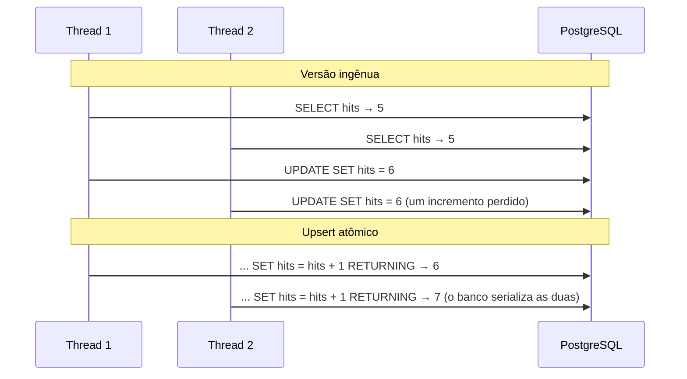

# PwnCheck — Fase 5: rate limit e métricas

> **Objetivo:** impedir que alguém use a API para testar mil senhas por minuto no login (ou
> para martelar o `/range`), respondendo **429** com um `Retry-After` honesto; e medir o uso
> da API por dia, sem guardar nada que identifique as pessoas.
>
> **Pré-requisito:** [Fase 4 — API e autenticação](fase-4-api-fastapi-autenticacao.md).

**O que você vai aprender:** força bruta *online* e *credential stuffing* · algoritmos de rate
limit (janela fixa, janela deslizante, *token bucket*) · a matemática da janela deslizante ·
`fractions.Fraction` e erros de ponto flutuante · testes que exercitam milhares de casos ·
contadores atômicos no PostgreSQL (e a corrida que eles evitam) · `X-Forwarded-For` e proxies
confiáveis · pseudonimização · HTTP 429 e `Retry-After` · fábricas de dependência (closures) ·
`BeforeValidator` e `NoDecode` no pydantic-settings · métricas agregadas · `argparse` com
`set_defaults` · `monkeypatch` e `ExitStack`.

> Os blocos `mermaid` viram diagramas no GitHub (ou no VS Code com a extensão *Markdown
> Preview Mermaid Support*). No fim há um **glossário**.

**Sumário**
1. [Por que limitar requisições](#1-por-que-limitar-requisições)
2. [Algoritmos de rate limit](#2-algoritmos-de-rate-limit)
3. [As contas: `ratelimit.py`](#3-as-contas-ratelimitpy)
4. [O teste que simula milhares de bloqueios](#4-o-teste-que-simula-milhares-de-bloqueios)
5. [Contadores no PostgreSQL: `limiter.py`](#5-contadores-no-postgresql-limiterpy)
6. [Quem é "quem": IP, usuário e e-mail](#6-quem-é-quem-ip-usuário-e-e-mail)
7. [Na API: 429, `Retry-After` e a dependência-fábrica](#7-na-api-429-retry-after-e-a-dependência-fábrica)
8. [Configuração: `"10/minute"` no `.env`](#8-configuração-10minute-no-env)
9. [Métricas de uso](#9-métricas-de-uso)
10. [Administradores e manutenção](#10-administradores-e-manutenção)
11. [Testes](#11-testes)
12. [Mão na massa](#12-mão-na-massa)
13. [Decisões de design (bom assunto para entrevista)](#13-decisões-de-design-bom-assunto-para-entrevista)
14. [Glossário](#14-glossário)
15. [Exercícios](#15-exercícios)
16. [Próxima fase](#16-próxima-fase)

---

## 1. Por que limitar requisições

Na fase 4, o Argon2id tornou inútil um vazamento da tabela de usuários (ataque *offline*).
Mas nada impedia o ataque **online**: mandar tentativas de login direto para a API.

| Ataque | Como funciona | O que o limite faz |
|---|---|---|
| **Força bruta online** | testar muitas senhas numa mesma conta | limite **por e-mail** |
| ***Credential stuffing*** | testar pares e-mail/senha vazados de outros sites, em muitas contas | limite **por IP** |
| **Ataque distribuído** | usar milhares de IPs (uma *botnet*) contra uma conta | o limite por e-mail pega; o por IP, não |
| **Abuso / negação de serviço** | martelar rotas caras (Argon2 custa 50 ms e 64 MiB!) | limite por IP e por usuário |
| **Enumeração** | descobrir quais e-mails têm conta (o 409 do cadastro) | limite por IP no cadastro |

O NIST (SP 800-63B-4, seção 3.2.2) exige que o verificador limite as tentativas **falhas
consecutivas** numa conta a **no máximo 100**. O nosso limite padrão por conta — 30 tentativas
por hora — fica bem abaixo disso.

---

## 2. Algoritmos de rate limit

| Algoritmo | Guarda | Vantagem | Problema |
|---|---|---|---|
| **Janela fixa** | 1 contador por janela | simples | deixa passar o **dobro** na virada da janela |
| **Log deslizante** | o instante de **cada** requisição | exato | memória proporcional ao tráfego |
| **Janela deslizante aproximada** | 2 contadores (janela atual e anterior) | quase exato, barato | é uma aproximação |
| **Token bucket** | "fichas" + instante da última recarga | permite rajadas controladas | um pouco mais difícil de explicar |

### O problema da janela fixa

"10 por minuto, zerando no minuto cheio":

```
            janela 12:00                    janela 12:01
  |────────────────────────────|────────────────────────────|
                     10 req. ──┤├── 10 req.
                     12:00:59  ││  12:01:00
                               └┴─ 20 requisições em 2 segundos, e a janela fixa aceita todas
```

### A janela deslizante aproximada

Guardamos só dois contadores e fazemos uma **média ponderada pelo tempo**: da janela
anterior, conta a fração que ainda "cabe" numa janela de 60 segundos terminando agora.

```
        janela anterior: 8            janela atual: 3
  |─────────────────────────────|───────────┬──────────────────|
  12:00                         12:01    12:01:15            12:02
                                             └ 25% da janela atual já passou

  estimativa = 8 × (1 − 0,25) + 3 = 9        (os 75% finais da anterior + toda a atual)
```

É o algoritmo que a Cloudflare descreveu para o rate limit dela, em escala de milhões de
sites. Com o exemplo da virada (10 às 12:00:59 e 10 às 12:01:00): às 12:01:00, a fração é 0,
e a estimativa é 10 × 1 + 10 = 20 > 10 — **barrado**. Há um teste com exatamente esse caso.

---

## 3. As contas: `ratelimit.py`

O módulo é **puro** (a regra de sempre): recebe números e datas, devolve decisões.

### O limite como valor: `Rate` e `parse_rate`

```python
@dataclass(frozen=True, slots=True)
class Rate:
    limit: int
    window: timedelta


_RATE_PATTERN = re.compile(r"\s*(\d+)\s*/\s*(second|minute|hour|day)\s*")


def parse_rate(text: str | Rate) -> Rate:
    ...
    match = _RATE_PATTERN.fullmatch(text)
    ...
    count, unit = match.groups()
    return Rate(limit=int(count), window=_UNITS[unit])
```

`"10/minute"` vira `Rate(limit=10, window=timedelta(minutes=1))`. A regex da fase 2 aparece
de novo, agora com **grupos de captura**: `match.groups()` devolve o texto de cada `(...)`, na
ordem — `("10", "minute")`.

### Em que janela estamos: `window_start`

```python
_EPOCH = datetime(1970, 1, 1, tzinfo=UTC)


def window_start(now: datetime, window: timedelta) -> datetime:
    return now - (now - _EPOCH) % window
```

É o `ts - ts % n` que você faria em C com um `time_t`: arredondar para baixo até um múltiplo
da janela. A diferença é que `timedelta % timedelta` é conta **inteira** (em microssegundos)
— sem erro de arredondamento.

### A decisão

```python
def decide(rate: Rate, *, previous: int, current: int, now: datetime) -> Decision:
    fraction = elapsed_fraction(now, rate.window)
    if estimate(previous, current, fraction) <= rate.limit:
        return Decision(allowed=True, retry_after=0)
    return Decision(allowed=False, retry_after=retry_after(...))
```

`current` **já inclui** a requisição que está sendo decidida, e as **recusadas também
contam**. Assim, quem insiste em bater no limite continua bloqueado, em vez de ganhar uma
tentativa nova a cada instante.

### O `Retry-After`: resolvendo uma desigualdade

Quando bloqueamos, dizemos **quando** tentar de novo. Uma nova requisição conta +1 na
janela em que chegar. Há dois cenários:

```
  1. Ainda nesta janela, na fração x:       previous · (1 − x) + current + 1  ≤  limite
                                            ⇒  x ≥ 1 − (limite − current − 1) / previous

  2. Na próxima janela, na fração y:        current · (1 − y) + 1  ≤  limite
     (a atual vira a "anterior")            ⇒  y ≥ 1 − (limite − 1) / current

  Duas janelas depois: 0 · (...) + 1 ≤ limite — sempre cabe. Por isso a espera é < 2 janelas.
```

O código tenta o cenário 1 (se houver vaga nesta janela) e, se não der, o 2. Repare numa
consequência: como as recusadas contam, o `Retry-After` pode passar do tamanho da janela.
No teste com o servidor real, depois de 13 tentativas com limite 10/minuto, a resposta foi
`Retry-After: 66`.

### O erro de ponto flutuante que um teste encontrou

A primeira versão fazia as contas com `float`. O teste da seção 4 falhou num caso:

```python
>>> (1 - 59/60 + 0.5) * 60
31.000000000000004
```

A conta exata dá **31**, mas o `float` (IEEE 754, o mesmo `double` do C) não representa
`59/60` exatamente, e o erro acumulado fez o teto (`math.ceil`) virar **32**. O cliente
esperaria um segundo a mais — nada grave, mas a promessa era "o `Retry-After` é exato".

A solução foi trocar para **frações exatas**:

```python
from fractions import Fraction

def elapsed_fraction(now: datetime, window: timedelta) -> Fraction:
    return Fraction((now - _EPOCH) % window // _MICROSECOND, window // _MICROSECOND)
```

`Fraction(59, 60)` guarda numerador e denominador **inteiros** e faz aritmética racional
exata: `1 - Fraction(59, 60) + Fraction(1, 2)` é exatamente `Fraction(31, 60)`, e
`math.ceil` sobre uma `Fraction` também é exato. Em C, você teria que implementar isso à mão
(uma struct com dois inteiros e o MDC para simplificar); em Python, vem na biblioteca padrão.
O custo é desempenho — irrelevante para duas contas por requisição.

> **Regra prática:** `float` para medidas (tempos, distâncias); inteiros ou `Fraction` /
> `Decimal` quando a resposta precisa ser **exata** (dinheiro, limites, arredondamentos que
> viram promessas).

---

## 4. O teste que simula milhares de bloqueios

Como testar uma fórmula como a do `Retry-After`? Escolher três exemplos à mão testa três
exemplos. Em vez disso, o teste **verifica a promessa** em milhares de situações:

```python
def test_retry_after_nunca_mente():
    for limit, window_seconds in [(1, 60), (3, 60), (10, 60), (5, 3600)]:
        rate = Rate(limit, timedelta(seconds=window_seconds))
        for previous, current, offset in itertools.product(
            range(0, 25), range(1, 25), [0, 1, 7, 30, 59]
        ):
            ...
            if decide(...).allowed:
                continue
            wait = retry_after(rate, previous=previous, current=current, now=now)
            assert _decide_after(rate, previous, current, now, wait).allowed          # basta
            if wait > 1:
                assert not _decide_after(rate, previous, current, now, wait - 1).allowed  # e é o mínimo
```

- **`itertools.product`** gera todas as combinações (o produto cartesiano) — três `for`
  aninhados numa linha só.
- `_decide_after` **simula** a passagem do tempo: se a espera cruza para a janela seguinte, a
  atual vira a anterior; se cruza duas, zera.
- A promessa tem duas partes: esperar o `Retry-After` **basta**, e esperar um segundo a menos
  **não basta** (a espera é a mínima).

Essa ideia — afirmar uma **propriedade** que vale para todas as entradas, em vez de listar
exemplos — se chama *property-based testing*. Existem bibliotecas que geram as entradas
aleatoriamente e ainda "encolhem" o caso que falhou até o menor exemplo possível (a
**Hypothesis**, em Python). Aqui, um laço sobre uma grade de valores bastou para achar o bug
do ponto flutuante.

---

## 5. Contadores no PostgreSQL: `limiter.py`

### Por que não um dicionário em memória?

Um `dict` `{chave: contagem}` seria mais rápido. Mas a aplicação pode rodar em vários
**processos** (workers do uvicorn) ou várias máquinas: cada um teria o seu dicionário, e o
limite real seria multiplicado pelo número de processos. Precisamos de um lugar
**compartilhado**. O Redis é a escolha clássica; nós já temos o PostgreSQL.

```
  SEM estado compartilhado                       COM o PostgreSQL
  ┌─ worker 1: {ip: 10} ─┐                      ┌─ worker 1 ─┐
  │                      │ limite real: 20       │            ├──> rate_limit_counters
  └─ worker 2: {ip: 10} ─┘                      └─ worker 2 ─┘     (um contador só)
```

### A tabela e o incremento atômico

```python
class RateLimitCounter(Base):
    __tablename__ = "rate_limit_counters"

    key: Mapped[str] = mapped_column(String(80), primary_key=True)
    window_start: Mapped[datetime] = mapped_column(DateTime(timezone=True), primary_key=True)
    hits: Mapped[int]
```

A chave primária é **composta** `(key, window_start)`: uma linha por chave por janela. O
incremento é o upsert da fase 3, com um detalhe novo — o `RETURNING`:

```python
statement = (
    insert(RateLimitCounter)
    .values(key=key, window_start=start, hits=1)
    .on_conflict_do_update(
        index_elements=[RateLimitCounter.key, RateLimitCounter.window_start],
        set_={"hits": RateLimitCounter.hits + 1},
    )
    .returning(RateLimitCounter.hits)
)
current = session.execute(statement).scalar_one()
```

```sql
INSERT INTO rate_limit_counters (key, window_start, hits) VALUES (:key, :start, 1)
ON CONFLICT (key, window_start) DO UPDATE SET hits = rate_limit_counters.hits + 1
RETURNING rate_limit_counters.hits
```

`RateLimitCounter.hits + 1` no Python não soma nada: o SQLAlchemy sobrecarrega o `+` (como um
`operator+` do C++) para **montar** a expressão SQL `hits + 1`, que o banco calcula. E o
`RETURNING` devolve a contagem **depois** do incremento, na mesma operação.

### O experimento: atômico × ingênuo

Rodamos 20 threads, cada uma com a própria conexão, incrementando o mesmo contador 10 vezes ao
mesmo tempo (um `threading.Barrier` as solta juntas). Esperado: 200.

| Versão | Resultado |
|---|---|
| Upsert atômico (`SET hits = hits + 1` no banco) | **200** |
| Ingênua: lê o objeto, `row.hits = row.hits + 1` em Python, grava | **22** |

A versão ingênua perdeu **89%** das contagens. Duas threads leem `hits = 5`, as duas gravam
`6`: um incremento sumiu. É a mesma **corrida** do `contador++` sem mutex em C com
`pthread` — só que entre processos, via banco. No rate limit, isso significaria deixar passar
um atacante que mandasse requisições em paralelo.



---

## 6. Quem é "quem": IP, usuário e e-mail

A **chave** do contador define o que está sendo limitado:

| Rota | Chave | Limite padrão | Por quê |
|---|---|---|---|
| `POST /auth/login` | IP | 10/minuto | um IP testando muitas contas |
| `POST /auth/login` | e-mail | 30/hora | muitos IPs contra uma conta |
| `POST /auth/register` | IP | 5/hora | enumeração de e-mails, contas em massa |
| `POST /auth/refresh` | IP | 30/minuto | adivinhação de tokens |
| `POST /check`, `/policy` | usuário | 60/minuto | uso abusivo de uma conta |
| `GET /range/{prefixo}` | IP | 120/minuto | rota pública |

O login tem **dois** limites, e a ordem importa: o limite por e-mail é aplicado **antes** de
conferir a senha. Quem bateu no limite é barrado **até com a senha certa** — senão o limite não
serviria contra força bruta: a senha certa passaria assim que fosse encontrada. Há um teste
para isso (`test_limite_barra_ate_a_senha_certa`).

### O IP de verdade, atrás de um proxy

Na fase 6, o Caddy fica na frente da aplicação. Para o uvicorn, **toda** conexão vem do Caddy:
o IP de todos os usuários seria o mesmo, e um único usuário bloquearia todos. O Caddy resolve
isso mandando o IP original num cabeçalho:

```
  usuário 203.0.113.7 ──> Caddy ──> uvicorn
                                     conexão vem de 172.18.0.3 (o Caddy)
                                     X-Forwarded-For: 203.0.113.7   <- o IP real
```

Mas qualquer um pode **escrever** esse cabeçalho. Se o uvicorn confiasse nele vindo de
qualquer lugar, um atacante mandaria `X-Forwarded-For: 1.2.3.<aleatório>` a cada requisição e
teria um "IP novo" sempre — escapando do limite. Por isso o uvicorn só aceita o cabeçalho
quando a conexão vem de um proxy **confiável** (a opção `--forwarded-allow-ips`). Na fase 6,
a aplicação só é alcançável pelo Caddy, e é nele que confiamos. `client_ip()` em `deps.py`
simplesmente lê `request.client.host`, que o uvicorn já corrigiu.

### Pseudonimização

O IP e o e-mail são **dados pessoais** (LGPD). A chave guarda o SHA-256 deles:

```python
def rate_key(scope: str, identifier: str) -> str:
    digest = hashlib.sha256(identifier.encode("utf-8")).hexdigest()[:32]
    return f"{scope}:{digest}"
```

`rate_key("login-ip", "203.0.113.7")` → `"login-ip:5f1c..."`. Isso é **pseudonimização**,
não anonimato: um IPv4 tem só 2³² valores, e o hash pode ser revertido por força bruta em
minutos. Mas o banco não guarda o dado em claro, e as linhas são apagadas em dois dias
(seção 10). Ser honesto sobre o que uma proteção **não** faz é tão importante quanto
implementá-la.

---

## 7. Na API: 429, `Retry-After` e a dependência-fábrica

```python
def enforce_rate_limit(session, settings, *, scope, identifier, rate) -> None:
    if not settings.rate_limit_enabled:
        return
    now = datetime.now(UTC)
    decision = hit(session, rate_key(scope, identifier), rate, now=now)
    if not decision.allowed:
        metrics.record(session, now.date(), rate_limited=1)
    session.commit()
    if not decision.allowed:
        raise HTTPException(
            status.HTTP_429_TOO_MANY_REQUESTS,
            detail="Muitas requisições. Espere um pouco antes de tentar de novo.",
            headers={"Retry-After": str(decision.retry_after)},
        )
```

- **429 Too Many Requests** (RFC 6585) com **`Retry-After`** (RFC 9110): o padrão HTTP para
  "devagar". Clientes bem-comportados (e bibliotecas de *retry*) esperam o tempo indicado.
- **O `commit()` vem antes da rota.** A contagem precisa ficar gravada mesmo que a requisição
  falhe depois — é justamente quem erra a senha que queremos contar.

### A dependência-fábrica

Cada rota tem um escopo e um limite diferentes. Em vez de escrever uma dependência por rota,
uma **fábrica** as cria:

```python
def limit_by_ip(scope: str, rate_of: RateOf) -> Any:
    def dependency(request: Request, session: DbSession, settings: SettingsDep) -> None:
        enforce_rate_limit(
            session, settings, scope=scope, identifier=client_ip(request), rate=rate_of(settings)
        )

    return Depends(dependency)


@router.get("/range/{prefix}", dependencies=[limit_by_ip("range-ip", lambda s: s.rate_limit_range_ip)])
```

`dependency` é uma **closure** (Lição 01, seção 9): cada chamada a `limit_by_ip` cria uma
função nova que "lembra" o `scope` e o `rate_of` recebidos. Em C, você passaria esses valores
num `void *contexto` junto com o ponteiro de função; a closure faz isso por você.

- **`lambda s: s.rate_limit_range_ip`** é uma função anônima de uma linha: "dado `s`, devolva
  `s.rate_limit_range_ip`". Ela adia a leitura do limite até a requisição, quando as
  configurações existem.
- **`dependencies=[...]`** no decorador: dependências que rodam antes da rota, mas cujo
  resultado a rota não usa.
- **401 antes de 429:** `limit_by_user` depende de `CurrentUser`. Sem token, a resposta é 401
  e nada é contado (há teste).

---

## 8. Configuração: `"10/minute"` no `.env`

```python
RateSetting = Annotated[Rate, NoDecode, BeforeValidator(parse_rate)]


class Settings(CacheSettings):
    rate_limit_login_ip: RateSetting = parse_rate("10/minute")
    ...
```

- **`BeforeValidator(parse_rate)`** roda **antes** da validação do tipo: transforma o texto
  `"10/minute"` num `Rate`. Um valor inválido (`"muitos por minuto"`) vira erro na subida da
  aplicação, com a mensagem de `parse_rate`.
- **`NoDecode`: o bug que só aparecia pelo ambiente.** Os testes passavam, mas ao ler o
  `.env.example` a aplicação quebrava:

  ```
  pydantic_settings.exceptions.SettingsError: error parsing value for field
  "rate_limit_login_ip" from source "DotEnvSettingsSource"
  ```

  Para campos de tipos "complexos" (como a nossa dataclass `Rate`), o pydantic-settings tenta
  ler o valor da variável de ambiente como **JSON** — e `10/minute` não é JSON. Os testes não
  pegavam porque passavam o valor pelo construtor (`Settings(rate_limit_login_ip="3/minute")`),
  que não passa por esse caminho. O marcador `NoDecode` desliga a decodificação JSON, e o
  teste de regressão `test_limites_lidos_de_variaveis_de_ambiente` usa a fixture
  **`monkeypatch`** do pytest para definir a variável de ambiente só durante o teste:

  ```python
  def test_limites_lidos_de_variaveis_de_ambiente(make_settings, monkeypatch):
      monkeypatch.setenv("RATE_LIMIT_LOGIN_IP", "7/hour")
      assert make_settings().rate_limit_login_ip == Rate(7, timedelta(hours=1))
  ```

  A lição: **teste pelo mesmo caminho que a produção usa**.

---

## 9. Métricas de uso

Queremos saber como a API é usada — quantas verificações, quantos vazamentos encontrados,
quanto o cache economiza — **sem guardar quem fez o quê**. A solução são **contadores
agregados por dia**:

```python
class UsageMetrics(Base):
    __tablename__ = "usage_metrics"

    id: Mapped[int] = mapped_column(BigInteger, Identity(), primary_key=True)
    day: Mapped[date] = mapped_column(Date, unique=True)
    checks: Mapped[int] = mapped_column(default=0, server_default=text("0"))
    ...
```

> **Por que `day` e não `date`?** Dentro do corpo da classe, depois de `date: Mapped[date] = ...`,
> o nome `date` passaria a se referir ao **atributo** da classe, e não mais ao tipo `date`
> importado — as anotações seguintes que usassem `date` quebrariam. Nomes de colunas não devem
> esconder nomes de tipos.

Registrar é um upsert com **argumentos nomeados variáveis**:

```python
def record(session: Session, day: date, **increments: int) -> None:
    statement = insert(UsageMetrics).values(day=day, **increments)
    statement = statement.on_conflict_do_update(
        index_elements=[UsageMetrics.day],
        set_={
            name: getattr(UsageMetrics, name) + getattr(statement.excluded, name)
            for name in increments
        },
    )
    session.execute(statement)


metrics.record(session, hoje, checks=1, breached=1, cache_hits=1)
```

- `**increments` recolhe `checks=1, breached=1, ...` num dicionário; o `set_` é montado com
  uma *dict comprehension* só para as colunas recebidas.
- `getattr(UsageMetrics, "checks")` é o mesmo que `UsageMetrics.checks` — mas com o nome numa
  variável.
- Na rota, `**{metrics.CACHE_COUNTER[source]: 1}` **monta** o argumento nomeado a partir de um
  valor: se a faixa veio do cache, vira `cache_hits=1`; se da API, `cache_misses=1`.

O relatório fica em **`GET /admin/metrics?days=7`**, só para administradores:

```json
{
  "days": [{"day": "2026-09-29", "checks": 0, "ranges": 6, "cache_hits": 5,
            "cache_misses": 1, "rate_limited": 4, ...}],
  "totals": {"ranges": 6, "cache_hits": 5, "cache_misses": 1, "rate_limited": 4, ...},
  "cache_hit_rate": 0.8333
}
```

(Resultado real, depois dos testes manuais desta fase: 83% das faixas vieram do cache, e 4
requisições foram barradas.) `Query(ge=1, le=90)` valida o parâmetro `days` da URL, como o
`Field` valida o corpo.

---

## 10. Administradores e manutenção

A fase 4 criou o papel de administrador (`require_admin`); agora há como concedê-lo — **fora da
API**, por um comando no servidor:

```powershell
python -m app.manage make-admin gil.monteiro@exemplo.com
python -m app.manage make-admin gil.monteiro@exemplo.com --revoke
```

Três tabelas crescem com o tempo: o cache, os contadores do rate limit e os refresh tokens. O
`manage.py` ganhou as limpezas, e um comando que roda as três:

```
> python -m app.manage maintenance
0 faixa(s) expirada(s) apagada(s).
0 contador(es) de rate limit apagado(s).
0 refresh token(s) apagado(s).
```

Na fase 6, ele vai para o **cron** do servidor (o agendador de tarefas do Linux). Um detalhe
de `purge_refresh_tokens`: tokens **usados** mas ainda dentro da validade **ficam** — são eles
que permitem detectar o reuso de um token roubado (fase 4). Há teste para isso.

### `argparse` com `set_defaults`

```python
subparsers.add_parser(name, help=help_text).set_defaults(handler=handler)
...
args = build_parser().parse_args(argv)
output = args.handler(ctx)
```

`set_defaults(handler=...)` guarda a **função** do subcomando no resultado do `parse_args`: o
`main` só chama `args.handler(ctx)`, sem `if`/`elif` por comando. É a tabela de ponteiros para
função da fase 3, agora pendurada no próprio parser.

---

## 11. Testes

33 testes novos (196 no total):

- **`test_ratelimit.py`** (puro): `parse_rate` (válidos e inválidos), `window_start`, a
  estimativa do exemplo, a virada da janela fixa, e o `test_retry_after_nunca_mente`.
- **`test_api_limits.py`** (banco + HTTP): o contador atômico com a janela anterior, 429 por IP,
  por e-mail (ataque distribuído), "barra até a senha certa", por usuário, 401 antes de 429,
  desligar o limite, configuração inválida e **pelo ambiente**, métricas (acesso só de admin e
  as contagens exatas depois de uma sequência de chamadas).
- **`test_manage.py`**: `make-admin` (e `--revoke`), a limpeza de refresh tokens (quais ficam e
  quais saem) e o `maintenance`.

Para testar limites diferentes, a fixture virou uma **fábrica**:

```python
api = make_api(rate_limit_login_ip="3/minute", rate_limit_login_email="100/hour")
```

Por dentro, ela usa um **`contextlib.ExitStack`**: um gerenciador de contexto que acumula
outros e fecha **todos** no fim. Cada `TestClient` criado entra na pilha com
`stack.enter_context(...)`, e o pytest fecha a pilha ao terminar o teste — como uma lista de
destrutores a chamar.

> **Um ajuste no ruff:** o teste tem `def login(api, email=EMAIL, password="senha errada")`, e a
> regra **S107** (bandit) acusou "senha escrita num valor padrão de argumento". Em testes, é
> dado de teste de propósito — a mesma família das S105/S106, que já estavam liberadas só para
> `tests/`. A S107 entrou na mesma lista, no `pyproject.toml`.

---

## 12. Mão na massa

```powershell
cd C:\dev\pwncheck
git pull
.\.venv\Scripts\Activate.ps1
python -m pip install -r requirements-dev.txt
# acrescente ao seu .env as linhas da seção "Rate limit (fase 5)" do .env.example

docker compose up -d
alembic upgrade head               # 0003: rate_limit_counters e usage_metrics
pytest -v                          # esperado: 196 passed
uvicorn app.main:create_app --factory --reload
```

Em outro terminal, provoque o limite do login (12 tentativas; o limite é 10 por minuto):

```powershell
1..12 | ForEach-Object {
  $null = Invoke-RestMethod -Method Post -Uri http://127.0.0.1:8000/auth/login `
    -ContentType "application/json" -Body '{"email":"x@exemplo.com","password":"errada"}' `
    -SkipHttpErrorCheck -StatusCodeVariable status -ResponseHeadersVariable headers
  "$status $($headers['Retry-After'])"
}
```

Você deve ver dez `401` e depois `429` com o número de segundos. (`-SkipHttpErrorCheck`,
`-StatusCodeVariable` e `-ResponseHeadersVariable` existem a partir do PowerShell 7.)

Depois:

1. Promova a sua conta: `python -m app.manage make-admin seu-email@exemplo.com`.
2. No `/docs`, faça login, clique em **Authorize**, e chame `GET /admin/metrics`.
3. Use a página inicial algumas vezes e veja os contadores `ranges` e `cache_hits` subirem.
4. No `psql`: `SELECT key, window_start, hits FROM rate_limit_counters;` — repare que não há
   IP nem e-mail legível.

---

## 13. Decisões de design (bom assunto para entrevista)

- **Por que janela deslizante e não token bucket?** Os dois são bons. A janela deslizante
  aproximada tem uma explicação visual simples, dois contadores por chave e um `Retry-After`
  calculável exatamente. O *token bucket* permite rajadas controladas (útil para APIs com
  picos legítimos) — é o exercício 5.
- **Por que no PostgreSQL e não no Redis?** Um serviço a menos para operar e proteger. O custo
  são duas consultas por requisição limitada — irrelevante nesta escala. Se a carga crescer, o
  módulo `limiter.py` é o único lugar a trocar (as contas em `ratelimit.py` continuam iguais).
- **Por que contar as requisições recusadas?** Quem insiste é penalizado; quem respeita o
  `Retry-After` volta logo. A alternativa (contar só as aceitas) exigiria "verificar e depois
  incrementar", com a janela de corrida da seção 5.
- **Por que limitar por e-mail, se isso permite bloquear a conta de outra pessoa?** É a troca
  clássica: o limite por conta protege contra ataque distribuído, mas um atacante pode gastar
  as tentativas de uma vítima. Mitigações: o limite é por **hora** (não bloqueia para sempre),
  e o NIST sugere alternativas como CAPTCHA ou atrasos crescentes — temas do AuthHub.
- **Por que métricas agregadas e não um log de requisições?** Um log por requisição (com IP,
  horário e rota) é um dado pessoal, que exige base legal, retenção e proteção. Contadores por
  dia respondem às perguntas de uso sem nada disso (coleta mínima, LGPD).

---

## 14. Glossário

| Termo | O que é |
|---|---|
| **Rate limit** | Limite de requisições por intervalo de tempo. |
| **Força bruta online** | Testar senhas contra o serviço no ar (ao contrário do ataque offline a um banco vazado). |
| **Credential stuffing** | Testar pares e-mail/senha vazados de outros sites. |
| **Botnet** | Rede de máquinas comprometidas, usada para ataques distribuídos. |
| **Janela fixa** | Contador que zera em instantes fixos (o minuto cheio). |
| **Janela deslizante** | Limite sobre "os últimos N segundos", a qualquer momento. |
| **Token bucket** | Balde de fichas recarregado a taxa constante; cada requisição gasta uma. |
| **429 Too Many Requests** | Status HTTP para "requisições demais" (RFC 6585). |
| **Retry-After** | Cabeçalho com quantos segundos esperar antes de tentar de novo. |
| **Ponto flutuante (IEEE 754)** | Representação binária aproximada de números reais (`float`, `double`). |
| **`Fraction`** | Número racional exato (numerador/denominador inteiros) da biblioteca padrão. |
| **Property-based testing** | Testar uma propriedade para muitas entradas, em vez de exemplos escolhidos à mão. |
| **Produto cartesiano** | Todas as combinações entre conjuntos (`itertools.product`). |
| **Chave primária composta** | Chave formada por mais de uma coluna. |
| **`RETURNING`** | Cláusula do PostgreSQL que devolve linhas afetadas por INSERT/UPDATE/DELETE. |
| **Operação atômica** | Executada inteira, sem que outra operação a interrompa no meio. |
| **Proxy reverso** | Servidor na frente da aplicação que repassa as requisições (o Caddy). |
| **X-Forwarded-For** | Cabeçalho com o IP original do cliente, escrito pelo proxy. |
| **Proxy confiável** | Proxy cujo X-Forwarded-For a aplicação aceita. |
| **Pseudonimização** | Trocar um dado pessoal por um identificador que não o revela diretamente. |
| **Closure** | Função que "lembra" variáveis do escopo onde foi criada. |
| **Fábrica** | Função que cria e devolve outros objetos ou funções. |
| **`lambda`** | Função anônima de uma expressão só. |
| **`BeforeValidator`** | Função do Pydantic que transforma o valor antes da validação do tipo. |
| **`NoDecode`** | Marcador do pydantic-settings: não tratar a variável de ambiente como JSON. |
| **`monkeypatch`** | Fixture do pytest que altera ambiente/atributos só durante um teste. |
| **`ExitStack`** | Gerenciador de contexto que acumula outros e fecha todos no fim. |
| **Métrica agregada** | Contagem somada (por dia), sem registro individual. |
| **Cron** | Agendador de tarefas periódicas do Linux. |

---

## 15. Exercícios

1. **Veja a janela fixa falhar.** Escreva uma função `decide_fixed(rate, current)` (só a janela
   atual, sem a anterior) e um teste mostrando que ela aceita 20 requisições em 2 segundos na
   virada do minuto, enquanto `decide` recusa.
2. **Reproduza o bug do `float`.** Numa cópia de `retry_after`, troque as `Fraction` por
   divisões comuns e rode o `test_retry_after_nunca_mente`. Qual caso falha primeiro?
3. **Cabeçalhos informativos.** Faça as respostas **permitidas** também informarem o limite:
   `RateLimit-Limit` (o limite) e `RateLimit-Remaining` (quantas ainda cabem, arredondando a
   estimativa para baixo). Dica: a dependência pode receber `response: Response` e escrever em
   `response.headers`.
4. **A corrida na prática.** Transforme o experimento da seção 5 num teste (com cuidado: as
   threads fazem commit de verdade — limpe a linha no fim, como no exercício 6 da fase 3).
5. **Desafio: token bucket.** Implemente `TokenBucket(capacity, refill_per_second)` em
   `ratelimit.py`, puro, com `take(tokens, last_refill, now) -> (allowed, tokens, retry_after)`,
   e um teste de propriedade parecido com o da seção 4. Onde ele seria melhor que a janela
   deslizante?
6. **Desafio: métricas no terminal.** Crie `python -m app.manage metrics --days 7`, que imprime
   a mesma informação de `/admin/metrics` numa tabela alinhada.

<details>
<summary>Respostas</summary>

1. `decide_fixed` é só `current <= rate.limit`. Com `current=10` às 12:00:59 (permitido) e,
   depois da virada, `current=10` de novo às 12:01:00 (permitido — a janela zerou), passaram
   20. Com `decide(previous=10, current=10, now=12:01:00)`, a estimativa é 20: recusado.
2. Falha o caso `Rate(3, 60 s)`, `previous=0`, `current=4`, às 12:00:59: a espera exata é 31 s,
   mas `(1 - 59/60 + 0.5) * 60 = 31.000000000000004`, e o `ceil` dá 32. A segunda metade do
   teste (esperar um segundo a menos **não** basta) é que pega o erro.
3. Na dependência, depois do `hit`: `response.headers["RateLimit-Limit"] = str(rate.limit)` e
   `response.headers["RateLimit-Remaining"] = str(max(0, rate.limit - math.ceil(estimativa)))`.
   Para isso, `hit` precisa devolver também a estimativa (acrescente um campo à `Decision`).
   Esses nomes vêm de um rascunho da IETF, ainda não é padrão final — por isso não entraram no
   projeto.
4. Use `db_engine` para criar as sessões das threads, `threading.Barrier(20)` para soltá-las
   juntas, e confira `hits == 200` no fim. Apague a linha num `finally`. Com a versão ingênua
   (lê, soma, grava), o teste falharia com um número bem menor — nós vimos 22.
5. `tokens = min(capacity, tokens + (now - last_refill).total_seconds() * refill_per_second)`;
   se `tokens >= 1`, permite e subtrai 1; senão, `retry_after = ceil((1 - tokens) /
   refill_per_second)`. O token bucket é melhor quando rajadas curtas são legítimas (um app que
   sincroniza 20 itens de uma vez e depois fica quieto): ele acumula até `capacity` fichas.
6. Reaproveite `metrics.daily_report` e `metrics.COUNTERS`; monte cada linha com f-strings de
   largura fixa (`f"{valor:>8}"`). Registre o comando com `add_parser("metrics")` e um
   `add_argument("--days", type=int, default=7)`.

</details>

---

## 16. Próxima fase

**Fase 6 — Deploy com HTTPS.** O PwnCheck está completo; falta colocá-lo no ar. Vamos escrever
o **Dockerfile** da aplicação (imagem enxuta, usuário sem privilégios), o
`docker-compose.prod.yml` com o **Caddy** (HTTPS automático com Let's Encrypt, HSTS, limite de
corpo) e as migrações rodando antes da aplicação subir, configurar o `--forwarded-allow-ips` da
seção 6 e seguir o guia de deploy do portfólio na Oracle Cloud.
